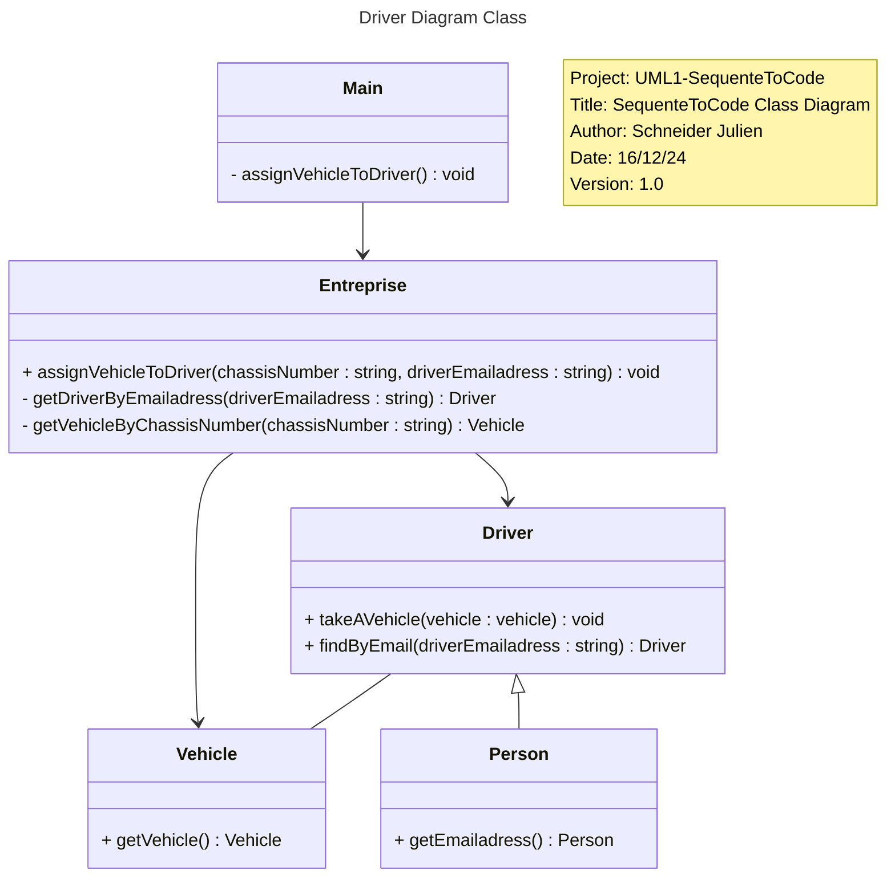

```mermaid

---
title: Driver Diagram Class
---

classDiagram

    note "Project: UML1-SequenteToCode
    Title: SequenteToCode Class Diagram
    Author: Schneider Julien
    Date: 16/12/24
    Version: 1.0"


    class Main {
        - assignVehicleToDriver () void
    }

    Main --> Entreprise

    class Entreprise {

        + assignVehicleToDriver(chassisNumber : string, driverEmailadress : string) void

        - getDriverByEmailadress(driverEmailadress : string) Driver

        - getVehicleByChassisNumber(chassisNumber : string) Vehicle
    }

    Entreprise --> Vehicle
    Entreprise --> Driver

    class Driver {
        + takeAVehicle(vehicle : vehicle) void
        + findByEmail (driverEmailadress : string) Driver
       }
        Driver <|-- Person
        Driver -- Vehicle

    class Person {
        + getEmailadress () Person
       }

    class Vehicle {
        + getVehicle () Vehicle
       }
```
