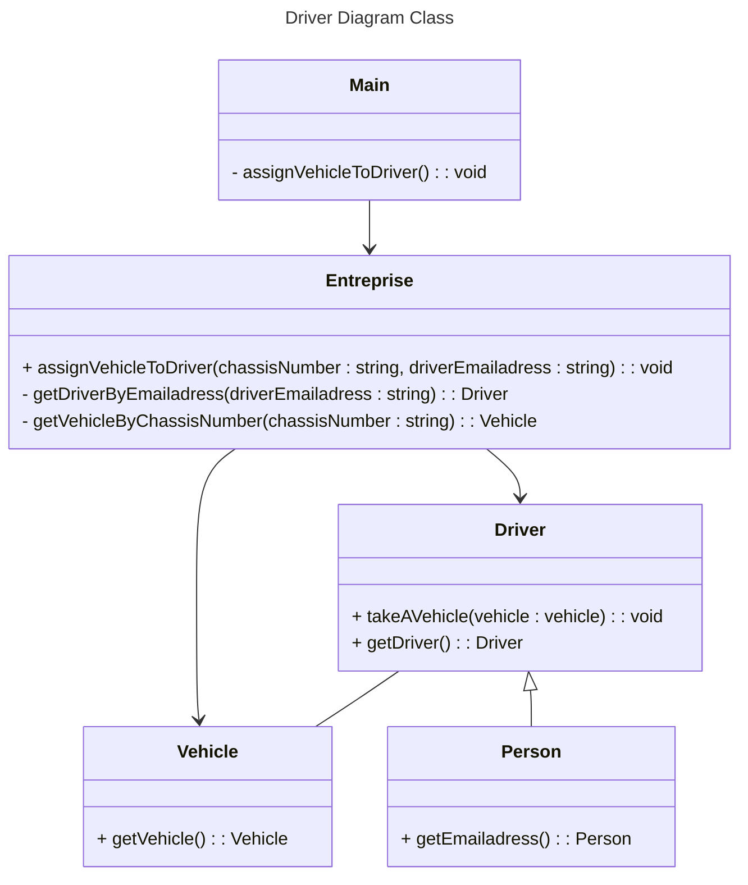

```mermaid

---
title: Driver Diagram Class
---

classDiagram

    class Main {
        - assignVehicleToDriver () : void
    }

    Main --> Entreprise

    class Entreprise {

        + assignVehicleToDriver(chassisNumber : string, driverEmailadress : string) : void

        - getDriverByEmailadress(driverEmailadress : string) : Driver

        - getVehicleByChassisNumber(chassisNumber : string) : Vehicle
    }

    Entreprise --> Vehicle
    Entreprise --> Driver

    class Driver {
        + takeAVehicle(vehicle : vehicle) : void
        + getDriver () : Driver
       }
        Driver <|-- Person
        Driver -- Vehicle

    class Person {
        + getEmailadress () : Person
       }

    class Vehicle {
        + getVehicle () : Vehicle
       }
```
